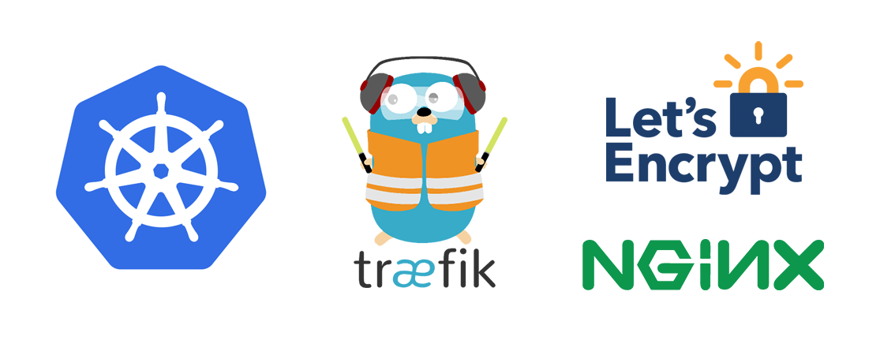

# How to Set Up Kubernetes,Nginx Ingress and Cert-Manager Cloud




## Index

1. [Client Tools](https://github.com/arthurbdiniz/k8s-digital-ocean/#Step-1--Client-Tools)
2. [Tiller and Role-based Access Control](https://github.com/arthurbdiniz/k8s-digital-ocean/#Step-2--Tiller-and-Role-based-Access-Control)
3. [Setup Cloud Cluster](https://github.com/arthurbdiniz/k8s-digital-ocean/#Step-3--Setup-Cloud-Cluster)
4. [Cluster Backend Setup](https://github.com/arthurbdiniz/kubernetes-cloud-setup#step-4--setting-up-dummy-backend-services)
5. [Ingress Controller](https://github.com/arthurbdiniz/kubernetes-cloud-setup#step-5---ingress-controller)
6. [Dashboard UI](https://github.com/arthurbdiniz/k8s-digital-ocean/#Step-6---Deploy-the-Dashboard-UI)

## Step 1 — Client Tools

#### Install Kubectl
The Kubernetes command-line tool, kubectl, allows you to run commands against Kubernetes clusters. You can use kubectl to deploy applications, inspect and manage cluster resources, and view logs. For a complete list of kubectl operations, see Overview of kubectl.
Just follow the download page [https://kubernetes.io/docs/tasks/tools/install-kubectl/](https://kubernetes.io/docs/tasks/tools/install-kubectl/)

#### Install Helm
If you already have Helm client and Tiller installed on your cluster, you can skip to the next section.

Helm is a tool that streamlines installing and managing Kubernetes applications and resources. Think of it like apt/yum/homebrew for Kubernetes. Use of helm charts is recommended since they are maintained and typically kept up-to-date by the Kubernetes community.

Helm has two parts: a client (helm) and a server (tiller)
Tiller runs inside of your Kubernetes cluster, and manages releases (installations) of your helm charts.
Helm runs on your laptop, CI/CD, or in our case, the Cloud Shell.
You can install the helm client in Cloud Shell using the following commands:
```
curl -o get_helm.sh https://raw.githubusercontent.com/kubernetes/helm/master/scripts/get
chmod +x get_helm.sh
./get_helm.sh
```
The script above fetches the latest version of helm client and installs it locally in Cloud Shell.
```
Downloading `https://kubernetes-helm.storage.googleapis.com/helm-v2.8.1-linux-amd64.tar.gz`
Preparing to install into `/usr/local/bin`
helm installed into `/usr/local/bin/helm`
Run `'helm init'` to configure helm.
```

## Step 2 - Tiller and Role-based Access Control
You can add a service account to Tiller using the --service-account <NAME> flag while you're configuring Helm. As a prerequisite, you'll have to create a role binding which specifies a role and a service account name that have been set up in advance.

Once you have satisfied the pre-requisite and have a service account with the correct permissions, you'll run a command like this: helm init --service-account <NAME>


Note: The cluster-admin role is created by default in a Kubernetes cluster, so you don't have to define it explicitly.
```bash
kubectl create -f https://raw.githubusercontent.com/arthurbdiniz/kubernetes-cloud-setup/master/rbac/rbac_config.yaml
```


````
# Output
serviceaccount "tiller" created
clusterrolebinding "tiller" created
````
```bash
helm init --service-account tiller
```


Now watch the tiller pod been created and wait to b deployed on your cluster.
```bash
kubectl get po -n kube-system -w
```

You should see at the end:
```bash
# Output
tiller-deploy-54fc6d9ccc-gp7sr                           1/1     Running   0          9m5s
```


## Step 3 - Setup Cloud Cluster
### [Digital Ocean](https://github.com/arthurbdiniz/kubernetes-cloud-setup/blob/master/Digital_Ocean/digital-ocean.md)
### [Google Kubernetes Engine](https://github.com/arthurbdiniz/kubernetes-cloud-setup/blob/master/Google_Kubernetes_Engine/google_kubernetes_engine.md)
### [Amazon Web Services (AWS)](https://github.com/arthurbdiniz/kubernetes-cloud-setup/blob/master/Amazon_Web_Services/amazon-web-services.md)


## Step 4 — Setting Up Dummy Backend Services
Before we deploy the Ingress Controller, we'll first create and roll out two dummy echo Services to which we'll route external traffic using the Ingress. The echo Services will run the hashicorp/http-echo web server container, which returns a page containing a text string passed in when the web server is launched. To learn more about http-echo, consult its GitHub Repo, and to learn more about Kubernetes Services, consult Services from the official Kubernetes docs.

On your local machine, apply echo1.yaml using kubectl:
```bash
$ kubectl create -f https://raw.githubusercontent.com/arthurbdiniz/kubernetes-cloud-setup/master/deployments/echo1.yaml
```
```bash
# Output
service/echo1 created
deployment.apps/echo1 created
```

This indicates that the echo1 Service is now available internally at 10.245.222.129 on port 80. It will forward traffic to containerPort 5678 on the Pods it selects.

Now that the echo1 Service is up and running, repeat this process for the echo2 Service.
```bash
$ kubectl create -f https://raw.githubusercontent.com/arthurbdiniz/kubernetes-cloud-setup/master/deployments/echo2.yaml
```
```bash
# Output
service/echo2 created
deployment.apps/echo2 created
```

Once again, verify that the Service is up and running:
```bash
kubectl get svc
```
You should see both the echo1 and echo2 Services with assigned ClusterIPs:
```bash
# Output
NAME         TYPE        CLUSTER-IP       EXTERNAL-IP   PORT(S)   AGE
echo1        ClusterIP   10.245.222.129   <none>        80/TCP    6m6s
echo2        ClusterIP   10.245.128.224   <none>        80/TCP    6m3s
kubernetes   ClusterIP   10.245.0.1       <none>        443/TCP   4d21h
```

## Step 5 - Ingress Controller
In this casa you can choose to use Nginx Ingress controller or Traefik Ingress Controller

### [Setting Up the Kubernetes Nginx Ingress Controller](https://github.com/arthurbdiniz/kubernetes-cloud-setup/blob/master/nginx_ingress_controller.md)

### [Setting Up the Traefik Ingress Controller](https://github.com/arthurbdiniz/kubernetes-cloud-setup/blob/master/traefik.md)

---

## Step 6 - Deploy the Dashboard UI
Kubernetes Dashboard is a general purpose, web-based UI for Kubernetes clusters. It allows users to manage applications running in the cluster and troubleshoot them, as well as manage the cluster itself.

[Tutorial Link](https://github.com/arthurbdiniz/kubernetes-cloud-setup/blob/master/dashboard.md)
